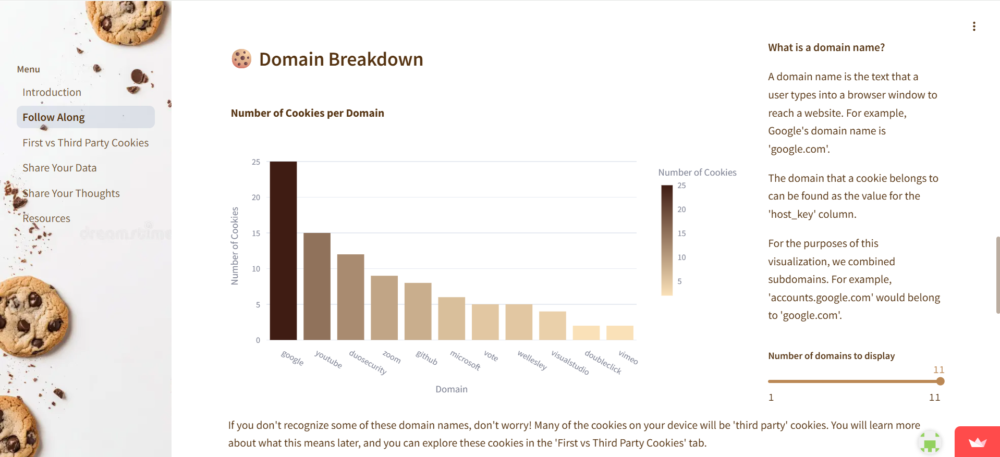

# Cookie Jar

Cookie Jar is an interactive website where users can learn about web cookies and explore their own browsing data. Wrote back-end functions for retrieving data and visualizations.

## Authors
* Nina Howley '27
* Dianna Gonzalez '27
* Jessica Chen '28
* Crystal Zhao '27

<h3><a href="https://cookiesproject.streamlit.app/" target="_blank">Website</a></h3>
<h3><a href="https://docs.google.com/presentation/d/1ptwSa7iPPFH59lXnABAMPUpgtUXNqvT1JhtzTnBm1uE/present?slide=id.g148f9c0646e_0_0" target="_blank">Presentation</a></h3>

### Landing Page



## Test Local Edits

1. **Clone the repository**
    ```
    git clone https://github.com/ninahowley/cleencode.git
    ```
2. **Edit and save file**
    ```
    ctrl + S
    ```
3. **Run the app!**

   Powershell: ```python -m streamlit run streamlit_app.py```

    Bash: ```streamlit run streamlit_app.py```

## Tech Stack

+ **Frontend:** Streamlit
+ **Backend:** Python, Pandas, Plotly, SQLite